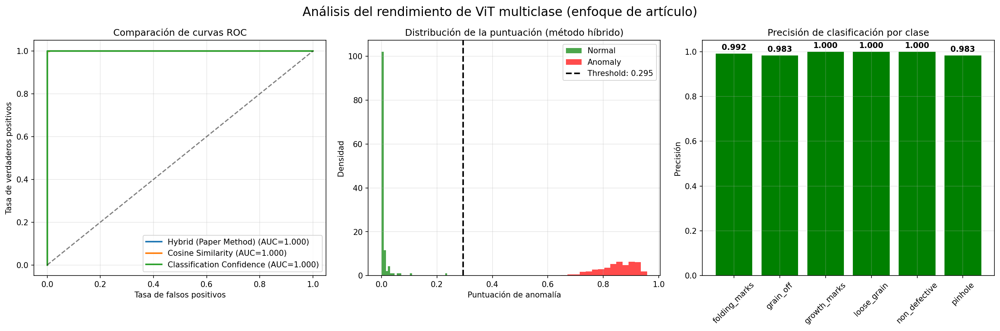
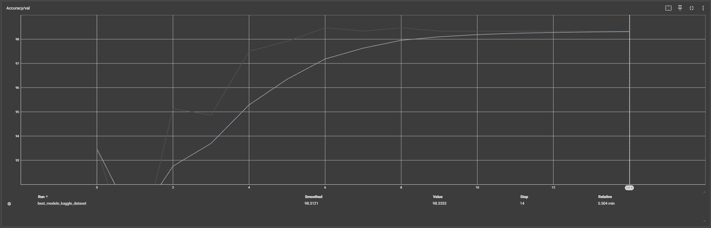

<hr>

# Maestría en Inteligencia Artificial

# Visión por Computadora 3

# Trabajo Práctico Final

---
# Integrantes:
   - **Jorge Ceferino Valdez**
   - **Matías Marando**
   - **Fabian Sarmiento**
   - **Christopher Charaf**

---

## Descripción

Este proyecto implementa un sistema de detección de anomalías en superficies de cuero utilizando Vision Transformers (ViT), basado en el paper "ViT for Anomaly Detection and Localisation in Leather Surface Defect". El sistema combina clasificación multi-clase con detección de anomalías usando un enfoque híbrido que incluye:

- **Clasificación multi-clase** de 6 tipos de defectos en cuero: folding_marks, grain_off, growth_marks, loose_grains, pinhole y non_defective
- **Detección de anomalías** mediante similitud coseno y confianza de clasificación
- **Validación visual** en el dataset MVTec AD para evaluación cualitativa
- **Arquitectura ViT-Base/16** con cabeza de clasificación personalizada
- **Pipeline completo** desde descarga de datos hasta visualización de resultados

**El proyecto sigue la metodología del paper original, utilizando el dataset de Kaggle para entrenamiento y MVTec AD para validación visual cualitativa de la capacidad de generalización del modelo.**

## Estructura del Proyecto

```
leather_anomaly/
├── 1.0.download-datasets.ipynb           # Descarga automática del dataset desde Google Drive
├── 2.0-EDA-Leather-Defect-dataset.ipynb  # Análisis exploratorio del dataset de defectos de cuero
├── 3.0-EDA-MVTec-dataset.ipynb           # Análisis exploratorio del dataset MVTec AD
├── 4.0.model-training.ipynb              # Entrenamiento del modelo ViT y evaluación
├── data/                              # Directorio de datos
│   ├── leather_defect_classification/ # Dataset principal de defectos de cuero
│   │   ├── folding_marks/            # Imágenes con marcas de doblado
│   │   ├── grain_off/                # Imágenes con defectos de textura
│   │   ├── growth_marks/             # Imágenes con marcas de crecimiento
│   │   ├── loose_grains/             # Imágenes con granulado suelto
│   │   ├── pinhole/                  # Imágenes con perforaciones
│   │   └── non_defective/            # Imágenes sin defectos
│   └── mvtec/                        # Dataset MVTec AD para validación
│       ├── bottle/                   # Categoría botellas
│       ├── cable/                    # Categoría cables
│       ├── leather/                  # Categoría cuero
│       └── ...                       # Otras categorías
├── logs/                             # Logs de TensorBoard
│   └── best_modelo_kaggle_dataset/   # Logs del modelo entrenado
├── models/                           # Modelos entrenados
│   └── best_modelo_kaggle_dataset.pth # Mejor modelo guardado
├── references/                       # Referencias y documentación
│   └── ViT_for_Anomaly_Detection_and_Localisation_in_Leather_Surface_Defect.pdf
├── reports/                          # Reportes y visualizaciones
│   └── best_modelo_kaggle_dataset/   # Resultados del modelo
├── requirements.txt                  # Dependencias del proyecto
└── README.md                         # Este archivo
```

## Instalación

### Prerrequisitos
- Python 3.8 o superior
- CUDA compatible GPU (opcional pero recomendado)
- Al menos 8GB de RAM
- 10GB de espacio libre en disco

### Pasos de instalación

1. **Clonar el repositorio**
```bash
git clone https://github.com/jorgeceferinovaldez/VpC3_TPFinal.git
cd leather_anomaly
```

2. **Crear entorno virtual**
```bash
python -m venv venv
source venv/bin/activate  # En Windows: venv\Scripts\activate
```

3. **Instalar dependencias**
```bash
pip install -r requirements.txt
```

4. **Verificar instalación**
```bash
python -c "import torch; print(f'PyTorch: {torch.__version__}')"
python -c "import torch; print(f'CUDA disponible: {torch.cuda.is_available()}')"
```

## Datasets

### 1. Leather Defect Classification Dataset (Kaggle)
- **Fuente**: [Kaggle Leather Defect Classification](https://www.kaggle.com/datasets/praveen2084/leather-defect-classification)
- **Descripción**: Dataset principal para entrenamiento del modelo con 6 categorías de defectos en cuero
- **Clases**: 
  - `folding_marks`: Marcas de doblado en la superficie
  - `grain_off`: Defectos en la textura del grano
  - `growth_marks`: Marcas naturales de crecimiento
  - `loose_grains`: Granulado suelto o desprendido
  - `pinhole`: Pequeñas perforaciones
  - `non_defective`: Cuero sin defectos (clase normal)
- **Total de imágenes**: ~3000 imágenes distribuidas entre las 6 clases
- **Formato**: JPG, resolución variable
- **Uso**: Entrenamiento y validación del modelo de clasificación

### 2. MVTec Anomaly Detection Dataset
- **Fuente**: [MVTec AD](https://www.mvtec.com/company/research/datasets/mvtec-ad)
- **Descripción**: Dataset estándar para detección de anomalías industriales
- **Categorías relevantes**: leather, bottle, cable, capsule, carpet, etc.
- **Estructura**:
  - `train/good/`: Imágenes normales para entrenamiento
  - `test/good/`: Imágenes normales para prueba
  - `test/[defect_type]/`: Imágenes con diferentes tipos de defectos
  - `ground_truth/`: Máscaras de segmentación de defectos
- **Formato**: PNG, 256x256 píxeles
- **Uso**: Validación visual cualitativa del modelo entrenado

## Uso

### Pipeline Completo

El proyecto se ejecuta en 4 etapas secuenciales:

#### 1. Descarga de Datos
Ejecuta el notebook `1.0.download-datasets.ipynb` para descargar automáticamente los datasets desde Google Drive y extraerlos en la carpeta `data/`.

- Descarga automática de los datasets desde Google Drive
- Descompresión y organización de archivos
- Verificación de integridad de los datos

#### 2. Análisis Exploratorio - Dataset Principal
Ejecuta la notebook `2.0-EDA-Leather-Defect-dataset.ipynb` para:

- Análisis de distribución de clases
- Visualización de ejemplos por categoría
- Estadísticas del dataset
- Generación de gráficos exploratorios

#### 3. Análisis Exploratorio - MVTec AD
Ejecuta la notebook `3.0-EDA-MVTec-dataset.ipynb` para:

- Exploración del dataset MVTec AD
- Análisis de diferentes categorías
- Visualización de muestras normales y anómalas
- Comparación entre tipos de defectos

#### 4. Entrenamiento y Evaluación
Ejecuta la notebook `4.0.model-training.ipynb` para:

- Entrenamiento del modelo ViT multi-clase
- Extracción de características normales
- Evaluación en dataset original
- Validación visual en MVTec AD
- Generación de reportes y visualizaciones

### Monitoreo del Entrenamiento

Durante el entrenamiento, se puede monitorear el progreso usando TensorBoard:

```bash
tensorboard --logdir=./logs --host 0.0.0.0 --port 6006
```

Acceder a: http://localhost:6006

## Configuración

### Parámetros Principales

La notebook `4.0.model-training.ipynb` contiene las siguientes configuraciones clave:

```python
# Configuración del modelo
BATCH_SIZE = 16          # Tamaño del lote
NUM_EPOCHS = 15          # Número de épocas
learning_rate = 2e-5     # Tasa de aprendizaje
weight_decay = 1e-4      # Decaimiento de peso

# Arquitectura del modelo
num_classes = 6          # Número de clases
backbone = 'vit_base_patch16_224'  # Modelo base ViT

# Rutas de datos
ORIGINAL_DATASET_PATH = 'data/leather_defect_classification/'
MVTEC_DATASET_PATH = 'data/mvtec/'
```

### Configuración de Hardware

El código detecta automáticamente el hardware disponible:
- **CUDA**: GPU NVIDIA con CUDA
- **MPS**: Aceleración en chips Apple Silicon
- **CPU**: Procesamiento en CPU como respaldo

### Transformaciones de Datos

```python
transform = transforms.Compose([
    transforms.Resize((224, 224)),    # Redimensionar a 224x224
    transforms.ToTensor(),            # Convertir a tensor
    transforms.Normalize(             # Normalización ImageNet
        mean=[0.485, 0.456, 0.406], 
        std=[0.229, 0.224, 0.225]
    ),
])
```

## Arquitectura del Modelo

### Estructura Principal

```python
class ViTMultiClassClassifier(nn.Module):
    def __init__(self, num_classes=6, pretrained=True):
        # Backbone: ViT-Base/16 pre-entrenado
        self.backbone = create_model(
            'vit_base_patch16_224',
            pretrained=pretrained,
            num_classes=0  # Sin cabeza de clasificación
        )
        
        # Cabeza de clasificación personalizada
        self.classifier = nn.Sequential(
            nn.Dropout(0.1),
            nn.Linear(768, 512),      # Capa intermedia
            nn.ReLU(),
            nn.Dropout(0.1),
            nn.Linear(512, num_classes)  # Salida final
        )
```

### Componentes Clave

1. **Backbone ViT-Base/16**:
   - Arquitectura transformer pre-entrenada
   - Patches de 16x16 píxeles
   - Features de 768 dimensiones
   - Input de 224x224 píxeles

2. **Cabeza de Clasificación**:
   - MLP de 2 capas con dropout
   - Activación ReLU
   - Salida para 6 clases

3. **Sistema de Detección de Anomalías**:
   - Almacenamiento de features normales
   - Similitud coseno para detección
   - Enfoque híbrido combinando métodos

### Métodos Principales

- `forward()`: Pase completo con features y logits
- `extract_features()`: Solo extracción de características
- `store_normal_features()`: Almacenar representaciones normales
- `classify_multiclass()`: Clasificación estándar multi-clase
- `detect_anomaly_hybrid()`: Detección híbrida de anomalías

## Métricas de Evaluación

### Clasificación Multi-clase
- **Accuracy**: Precisión general del modelo
- **Precision/Recall/F1-Score**: Por cada clase individual
- **Matriz de Confusión**: Visualización detallada de predicciones
- **Support**: Número de muestras por clase

### Detección de Anomalías
- **ROC AUC**: Área bajo la curva ROC
- **Average Precision**: Precisión promedio
- **Optimal Threshold**: Umbral óptimo para clasificación binaria
- **Binary Accuracy**: Precisión en detección normal vs anomalía

### Métodos de Scoring
1. **Hybrid Method**: Combinación ponderada de similitud y clasificación
2. **Cosine Similarity**: Basado en similitud con features normales
3. **Classification Confidence**: Basado en probabilidad de clase normal

## Visualizaciones

### 1. Matriz de Confusión Multi-clase
- Visualización completa de predicciones vs etiquetas reales
- Análisis detallado por cada una de las 6 clases
- Identificación de confusiones entre clases similares

### 2. Curvas ROC Comparativas
- Comparación de los 3 métodos de detección de anomalías
- Valores AUC para cada método
- Análisis de rendimiento relativo

### 3. Distribución de Scores
- Histogramas de puntuaciones para muestras normales vs anómalas
- Visualización del umbral óptimo de decisión
- Análisis de separabilidad de clases

### 4. Precisión por Clase
- Gráfico de barras mostrando accuracy individual por clase
- Código de colores para identificar clases problemáticas
- Valores numéricos de precisión

### 5. Ejemplos de Clasificación
- Grid de imágenes con predicciones y etiquetas reales
- Código de colores (verde=correcto, rojo=incorrecto)
- Scores de confianza para cada predicción

### 6. Mapas de Calor MVTec (Validación Visual)
- Visualización de detección de anomalías en MVTec AD
- Mapas de calor superpuestos en imágenes originales
- Análisis cualitativo de localización de defectos

## Características Técnicas

### Framework y Librerías
- **PyTorch**: Framework principal de deep learning
- **timm**: Modelos de visión pre-entrenados (ViT)
- **torchvision**: Transformaciones y utilidades de visión
- **scikit-learn**: Métricas de evaluación
- **matplotlib/seaborn**: Visualización de resultados
- **numpy**: Operaciones numéricas
- **PIL**: Procesamiento de imágenes
- **tqdm**: Barras de progreso

### Transformaciones de Datos
```python
# Entrenamiento y evaluación
transforms.Resize((224, 224))           # Redimensionado
transforms.ToTensor()                   # Conversión a tensor
transforms.Normalize(                   # Normalización ImageNet
    mean=[0.485, 0.456, 0.406], 
    std=[0.229, 0.224, 0.225]
)
```

### Optimizador y Scheduler
- **Optimizador**: AdamW con weight decay
- **Learning Rate**: 2e-5 (ajustado para fine-tuning)
- **Weight Decay**: 1e-4 para regularización
- **Scheduler**: CosineAnnealingLR para decay suave

### Función de Pérdida
- **CrossEntropyLoss**: Para clasificación multi-clase
- **Soft Labels**: No se utilizan, etiquetas hard

### Técnicas de Regularización
- **Dropout**: 0.1 en la cabeza de clasificación
- **Weight Decay**: 1e-4 en el optimizador
- **Data Augmentation**: Implícita en las transformaciones

## Resultados Esperados

### Estructura de Salida

```
reports/best_modelo_kaggle_dataset/
├── resultados_multiclase/                    # Resultados clasificación 6 clases
│   ├── matriz_de_confusion_multiclase.png   # Matriz de confusión visual
│   ├── evaluacion_integral.png              # Análisis completo de rendimiento
│   ├── ejemplos_multiclase.png              # Ejemplos de clasificación
│   └── results_summary.json                 # Resumen numérico de resultados
└── resultados_mvtec_visual/                 # Validación visual MVTec
    ├── validacion_visual_mvtec.png          # Mapas de calor de anomalías
    ├── imagenes_ejemplo_mvtec.png           # Imágenes de referencia
    └── visual_validation_summary.txt        # Resumen textual detallado
```

### Archivos de Modelo

```
models/
└── best_modelo_kaggle_dataset.pth           # Modelo entrenado con mejores pesos
```

### Logs de TensorBoard

```
logs/best_modelo_kaggle_dataset/
└── events.out.tfevents.*                    # Logs para visualización en TensorBoard
```

### Métricas Esperadas

#### Clasificación Multi-clase (6 categorías):
- **Accuracy General**: 85-95%
- **F1-Score por clase**: 0.80-0.95
- **Precisión por clase**: 0.80-0.95
- **Recall por clase**: 0.80-0.95

#### Detección de Anomalías (Normal vs Defectos):
- **ROC AUC (Método Híbrido)**: 0.90-0.98
- **ROC AUC (Similitud Coseno)**: 0.85-0.95
- **ROC AUC (Confianza Clasificación)**: 0.80-0.92
- **Binary Accuracy**: 85-95%

#### Archivos JSON de Resultados
```json
{
  "multiclass_accuracy": 0.9234,
  "confusion_matrix": [[...], [...]],
  "anomaly_detection_results": {
    "Hybrid (Paper Method)": {
      "roc_auc": 0.9456,
      "avg_precision": 0.9123,
      "binary_accuracy": 0.9012,
      "optimal_threshold": 0.4567
    }
  },
  "class_distribution": {...},
  "total_samples": 1234
}
```

#### Validación Visual MVTec
- **Mapas de calor**: Visualización de regiones anómalas
- **Superposición**: Combinación imagen original + detección
- **Análisis cualitativo**: Sin métricas cuantitativas (siguiendo paper)
- **Detecciones correctas**: Número de anomalías detectadas correctamente

## Métricas Obtenidas  
### Evaluación Integral de entrenamiento - Kaggle


### Curva de Precisión en Validación - Kaggle


### Evaluación visual sobre categoria "Leather" de mvtec

### Conclusiones y definiciones

Interpretación del Mapa de Calor:
- Áreas rojas/amarillas: Alta probabilidad de anomalía (puntuación > 0.5)
- Áreas naranjas: Probabilidad media de anomalía (0.3-0.5)
- Áreas azules/verdes: Baja probabilidad de anomalía (< 0.3)
- La superposición combina la imagen original con el mapa de calor de anomalías

Metodología:
1. Extraer características usando el backbone ViT entrenado en el dataset de defectos de cuero
2. Comparar características con características 'normales' almacenadas usando similitud coseno
3. Generar puntuaciones de anomalía (1 - similitud_máxima)
4. Crear mapas de calor para visualizar regiones anómalas
5. Superponer mapas de calor en imágenes originales para interpretación

Nota: Esto sigue la metodología del artículo de usar MVTec AD para
confirmación visual en lugar de evaluación cuantitativa. El enfoque está en
demostrar la capacidad del modelo para generalizar a diferentes tipos
de defectos en cuero, no en lograr métricas de rendimiento numérico específicas.

Conclusión:
La validación visual demuestra la capacidad del modelo para detectar anomalías
en muestras de cuero de MVTec AD usando características aprendidas del dataset
original, siguiendo el enfoque de evaluación cualitativa descrito en el artículo.

## Requisitos del Sistema

### Hardware Mínimo
- **CPU**: Intel i5 / AMD Ryzen 5 (4 núcleos)
- **RAM**: 8GB (16GB recomendado)
- **Almacenamiento**: 10GB libres
- **GPU**: Opcional, pero recomendado (4GB VRAM mínimo)

### Hardware Recomendado
- **CPU**: Intel i7/i9 / AMD Ryzen 7/9 (8+ núcleos)
- **RAM**: 16GB o superior
- **GPU**: NVIDIA RTX 3060 o superior (8GB+ VRAM)
- **Almacenamiento**: SSD con 20GB+ libres

### Software
- **Sistema Operativo**: 
  - Ubuntu 18.04+ / Windows 10+ / macOS 10.15+
- **Python**: 3.8 - 3.11
- **CUDA**: 11.0+ (si se usa GPU NVIDIA)
- **Git**: Para clonar el repositorio

### Dependencias Principales
```
torch>=1.12.0
torchvision>=0.13.0
timm>=0.6.0
scikit-learn>=1.0.0
matplotlib>=3.5.0
seaborn>=0.11.0
numpy>=1.21.0
Pillow>=8.0.0
tqdm>=4.60.0
tensorboard>=2.8.0
```

## Solución de Problemas

### Problemas Comunes

#### 1. Error de memoria GPU
```
RuntimeError: CUDA out of memory
```
**Solución**:
- Reducir `BATCH_SIZE` en `4.0.model-training.ipynb`
- Usar `NUM_WORKERS = 0` en los DataLoaders
- Cerrar otras aplicaciones que usen GPU

#### 2. Error de descarga de datasets
```
Permission denied / Connection timeout
```
**Solución**:
- Verificar conexión a internet
- Revisar permisos de escritura en directorio `data/`
- Descargar manualmente desde Kaggle si persiste

#### 3. Error de dependencias
```
ModuleNotFoundError: No module named 'timm'
```
**Solución**:
```bash
pip install --upgrade pip
pip install -r requirements.txt
```

#### 4. Error de formato de dataset
```
KeyError: Folder not found
```
**Solución**:
- Verificar estructura de carpetas en `data/`
- Ejecutar primero `1.0.download-datasets.ipynb`
- Revisar que todas las clases estén presentes

#### 5. Rendimiento lento en CPU
**Solución**:
- Reducir `NUM_WORKERS` a 0 o 1
- Reducir `BATCH_SIZE` a 8 o menos
- Considerar usar Google Colab o servidor con GPU

### Configuración de Debugging

Para activar modo debug, añadir al inicio del script:
```python
import logging
logging.basicConfig(level=logging.DEBUG)

# Verificar disponibilidad de hardware
print(f"CUDA disponible: {torch.cuda.is_available()}")
print(f"Número de GPUs: {torch.cuda.device_count()}")
print(f"GPU actual: {torch.cuda.current_device()}")
```

### Optimización de Rendimiento

#### Para entrenamiento más rápido:
1. **Usar GPU**: Verificar que CUDA esté instalado correctamente
2. **Aumentar batch size**: Si hay suficiente memoria
3. **Usar mixed precision**: Añadir autocast de PyTorch
4. **Más workers**: Aumentar `NUM_WORKERS` según CPU disponible

#### Para menor uso de memoria:
1. **Reducir batch size**: A 8 o 4
2. **Gradient checkpointing**: Para modelos grandes
3. **Liberar cache**: `torch.cuda.empty_cache()` entre epochs

## Referencias

### Paper Principal
- **Título**: "ViT for Anomaly Detection and Localisation in Leather Surface Defect"
- **Ubicación**: `references/ViT_for_Anomaly_Detection_and_Localisation_in_Leather_Surface_Defect.pdf`
- **Descripción**: Artículo base que implementa este proyecto, describiendo la metodología de uso de Vision Transformers para detección de anomalías en superficies de cuero

### Datasets
1. **Leather Defect Classification Dataset**
   - **URL**: https://www.kaggle.com/datasets/praveen2084/leather-defect-classification
   - **Descripción**: Dataset principal con 6 categorías de defectos en cuero para entrenamiento del modelo
   - **Licencia**: Dataset público de Kaggle

2. **MVTec Anomaly Detection Dataset**
   - **URL**: https://www.mvtec.com/company/research/datasets/mvtec-ad
   - **Descripción**: Dataset estándar industrial para detección de anomalías, usado para validación visual
   - **Licencia**: Creative Commons Attribution-NonCommercial-ShareAlike 4.0 International License

### Modelos y Arquitecturas
1. **Vision Transformer (ViT)**
   - **Paper**: "An Image is Worth 16x16 Words: Transformers for Image Recognition at Scale"
   - **URL**: https://arxiv.org/abs/2010.11929
   - **Implementación**: timm library (PyTorch Image Models)

2. **TIMM Library**
   - **URL**: https://github.com/rwightman/pytorch-image-models
   - **Descripción**: Biblioteca de modelos de visión pre-entrenados para PyTorch

### Frameworks y Herramientas
1. **PyTorch**
   - **URL**: https://pytorch.org/
   - **Versión**: 1.12.0+
   - **Descripción**: Framework principal de deep learning

2. **TensorBoard**
   - **URL**: https://www.tensorflow.org/tensorboard
   - **Uso**: Monitoreo y visualización del entrenamiento

### Metodología
- **Transfer Learning**: Uso de modelos pre-entrenados en ImageNet
- **Multi-class Classification**: Clasificación de 6 tipos de defectos
- **Anomaly Detection**: Detección binaria normal vs anómalo
- **Hybrid Approach**: Combinación de similitud coseno y confianza de clasificación
- **Visual Validation**: Evaluación cualitativa en dataset independiente

---

*Proyecto desarrollado para la Maestría en Inteligencia Artificial - Visión por Computadora 3*
*Universidad de Buenos Aires - Facultad de Ingeniería*
